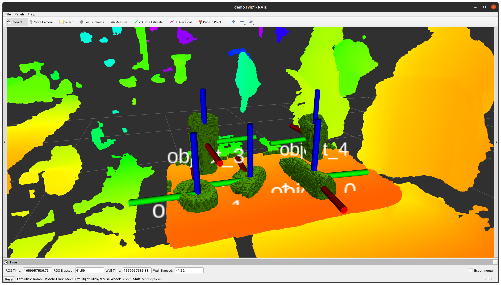
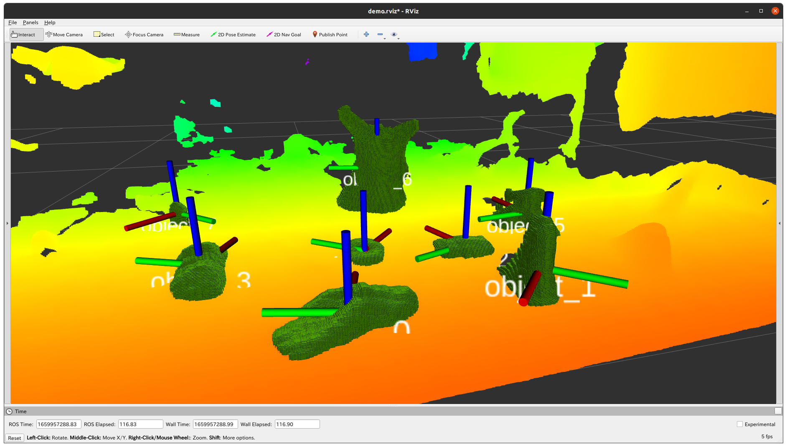
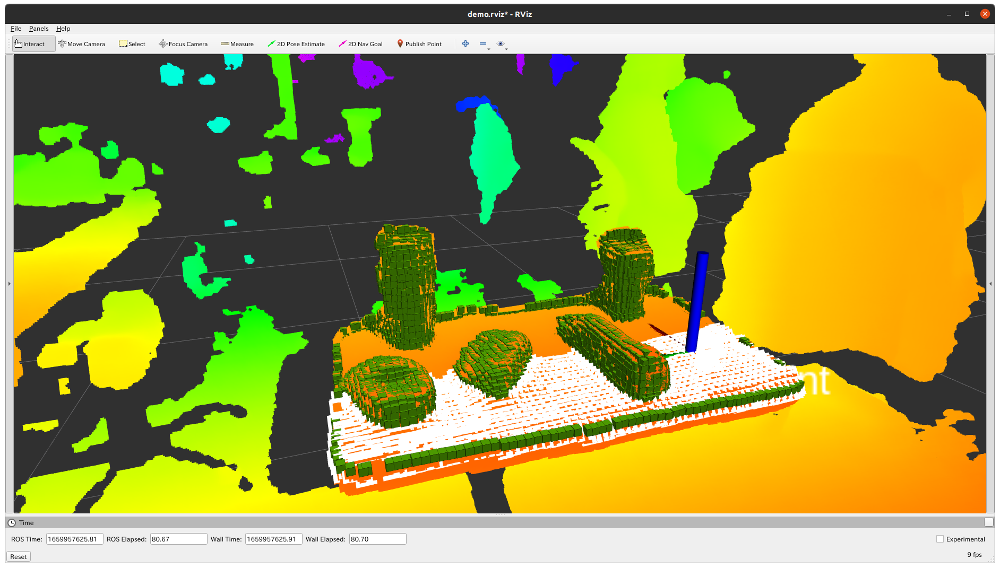
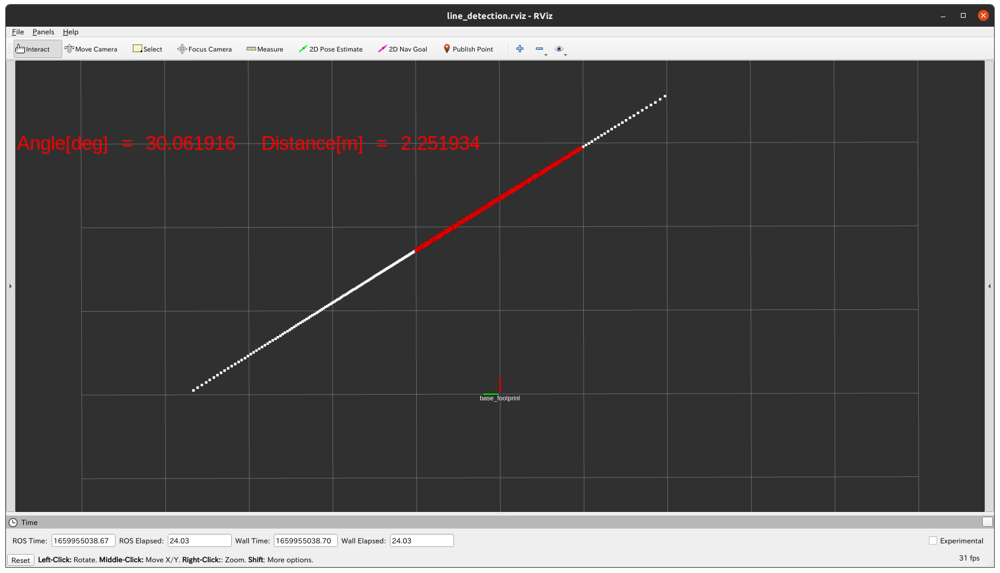
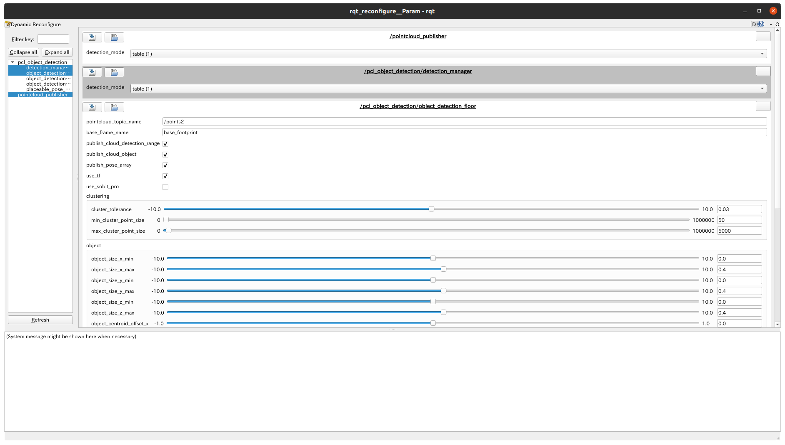

# **pcl_object_detection**
<a name="readme-top"></a>

[JP](README.md) | [EN](READMEen.md)

[![Contributors][contributors-shield]][contributors-url]
[![Forks][forks-shield]][forks-url]
[![Stargazers][stars-shield]][stars-url]
[![Issues][issues-shield]][issues-url]
<!-- [![MIT License][license-shield]][license-url] -->

<!-- 目次 -->
<details>
  <summary>目次</summary>
  <ol>
    <li>
      <a href="#概要">概要</a>
    </li>
    <li>
      <a href="#環境構築">環境構築</a>
      <ul>
        <li><a href="#環境条件">環境条件</a></li>
        <li><a href="#インストール方法">インストール方法</a></li>
      </ul>
    </li>
    <li><a href="#実行・操作方法">実行・操作方法</a></li>
    <li><a href="#マイルストーン">マイルストーン</a></li>
    <li><a href="#変更履歴">変更履歴</a></li>
    <!-- <li><a href="#contributing">Contributing</a></li> -->
    <!-- <li><a href="#license">License</a></li> -->
    <li><a href="#参考文献">参考文献</a></li>
  </ol>
</details>

<!-- レポジトリの概要 -->
## 概要

<!-- [![Product Name Screen Shot][product-screenshot]](https://example.com) -->

- Point Cloud Libraryを用いたルールベース物体検出パッケージ
- Lidar情報から直線を検出

<p align="right">(<a href="#readme-top">Topに戻る</a>)</p>


<!-- セットアップ -->
## セットアップ

ここで，本レポジトリのセットアップ方法について説明します。

### 環境条件
以下に正常動作環境を示します。
| System  | Version |
| ------------- | ------------- |
| Ubuntu | 20.04 (Focal Fossa) |
| ROS | Noetic Ninjemys |
| C++ | 3.10.2~ |

### インストール方法
1. ROSの`src`フォルダに移動します．
   ```sh
   $ roscd
   # roscdは設定によって"cd ~/catkin_ws/"のコマンドと同様
   $ cd src/
   ```
2. 本レポジトリをcloneします．
   ```sh
   $ git clone https://github.com/TeamSOBITS/pcl_object_detection.git
   ```
3. パッケージをコンパイルします．
   ```sh
   $ roscd
   $ catkin_make
   ```

<p align="right">(<a href="#readme-top">Topに戻る</a>)</p>


<!-- 実行・操作方法 -->
## 実行・操作方法

### [point_cloud_object_detection.launch](launch/point_cloud_object_detection.launch)
<!-- デモの実行方法やスクリーンショットがあるとわかりやすくなるでしょう -->
- 机、床、棚上の物体検出と配置位置の検出をします
- 検出位置はトピック通信とTFで出力されます
- 各検出モードはサービス通信によって変更可能
  - mode0 : OFF
  - mode1 : table mode(ymal fileにより高さの調節可能)
  - mode2 : floor mode(ymal fileにより高さの調節可能)
  - mode3 : shelf mode(ymal fileにより高さの調節可能)
  - mode4 : placeble detection(置き位置検出)

- 詳細は[こちら](doc/md/point_cloud_object_detection.md)

```bash
# rvizあり
roslaunch point_cloud_object_detection point_cloud_object_detection.launch
# rvizなし
roslaunch point_cloud_object_detection point_cloud_object_detection.launch rviz:=false
# rqt_reconfigureによるパラメータ調整
roslaunch point_cloud_object_detection point_cloud_object_detection.launch rqt_reconfigure:=true
```
※rqt_reconfigureはパラメータを動的に変更できるが，パラメータファイルは上書きされません。
※rqt_reconfigureでパラメータを調整後、パラメータファイルを手打ちで変更してください。

<div align="center">
    
    <!--  -->
    <!--  -->
</div>

- [Topに戻る](#pcl-object-detection)


## [line_detection.launch](launch/line_detection.launch)
- 2D-LiDARセンサから得た点群から直線を検出します
- 詳細は[こちら](doc/md/line_detection.md)

```bash
# rvizあり
roslaunch point_cloud_object_detection line_detection_param.launch
# rvizなし
roslaunch point_cloud_object_detection line_detection_param.launch rviz:=false
# rqt_reconfigureによるパラメータ調整
roslaunch point_cloud_object_detection line_detection_param.launch rqt_reconfigure:=true
```
※rqt_reconfigureはパラメータを動的に変更できるが，パラメータファイルは上書きされません。
※rqt_reconfigureでパラメータを調整後、パラメータファイルを手打ちで変更してください。

<div align="center">
    
</div>

- [Topに戻る](#pcl-object-detection)

## [demo.launch](launch/demo/demo.launch)
```bash
# TABLE_MODE
$ roslaunch pcl_object_detection demo.launch detection_mode:=1
# FLOOR_MODE
$ roslaunch pcl_object_detection demo.launch detection_mode:=2
# SHELF_MODE
$ roslaunch pcl_object_detection demo.launch detection_mode:=3
# PLACEABLE_POSITION
$ roslaunch pcl_object_detection demo.launch detection_mode:=4
# line_detection
$ roslaunch pcl_object_detection demo_line.launch
```
<div align="center">
    
</div>

<!-- マイルストーン -->
## マイルストーン

- [ ] ドキュメントの充実
- [ ] OSS化
  - [ ] tfからtf2への移行
  - [ ] 独自のメッセージ型から公開メッセージへ更新

現時点のバッグや新規機能の依頼を確認するために[Issueページ](https://github.com/TeamSOBITS/pcl_object_detection/issues) をご覧ください．

<p align="right">(<a href="#readme-top">上に</a>)</p>

<!-- 変更履歴 -->
## 変更履歴
  変更履歴はrst.fileを参照してください
<!-- 参考文献 -->
## 参考文献

* []()
* []()
* []()

<p align="right">(<a href="#readme-top">Topに戻る</a>)</p>


<!-- MARKDOWN LINKS & IMAGES -->
<!-- https://www.markdownguide.org/basic-syntax/#reference-style-links -->
[contributors-shield]: https://img.shields.io/github/contributors/TeamSOBITS/ar_track_alvar.svg?style=for-the-badge
[contributors-url]: https://github.com/TeamSOBITS/ar_track_alvar/graphs/contributors
[forks-shield]: https://img.shields.io/github/forks/TeamSOBITS/ar_track_alvar.svg?style=for-the-badge
[forks-url]: https://github.com/TeamSOBITS/ar_track_alvar/network/members
[stars-shield]: https://img.shields.io/github/stars/TeamSOBITS/ar_track_alvar.svg?style=for-the-badge
[stars-url]: https://github.com/TeamSOBITS/ar_track_alvar/stargazers
[issues-shield]: https://img.shields.io/github/issues/TeamSOBITS/ar_track_alvar.svg?style=for-the-badge
[issues-url]: https://github.com/TeamSOBITS/ar_track_alvar/issues
[license-shield]: https://img.shields.io/github/license/TeamSOBITS/ar_track_alvar.svg?style=for-the-badge
[license-url]: https://github.com/TeamSOBITS/ar_track_alvar/blob/master/LICENSE.txt