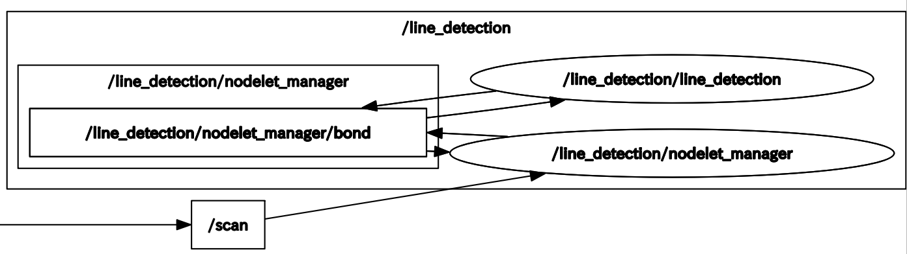

# Line Detection

## Contents

- [line_detection.launch](#line_detection)
    - [Node](#node)
    - [Subscriptions](#subscriptions)
    - [Publications](#publications)
    - [Services](#services)
    - [Parameters: 入出力関連](#parameters-入出力関連)
    - [Parameters: PCL関連](#parameters-pcl関連)


## [line_detection.launch](../../launch/line_detection.launch)

- 2D-LiDARセンサから得た点群から直線を検出します．
- パラメータファイル : [line_detection_param.yaml](../../param/line_detection_param.yaml)．


```bash
# with rviz
$ roslaunch pcl_object_detection line_detection_param.launch
# without rviz
$ roslaunch pcl_object_detection line_detection_param.launch rviz:=false
# rqt_reconfigure-based parameter configuration
$ roslaunch pcl_object_detection line_detection_param.launch rqt_reconfigure:=true
```

> [!NOTE]
> rqt_reconfigureはパラメータを動的に変更できるが，保存はできませんので，手打ちで更新してください． 

<div align="center">
    
</div>


## Node

| Node Name | Meaning |
| --- | --- |
| /line_detection/nodelet_manager | ノードレットの管理 |
| /line_detection/line_detection  | 直線を検出する |


## Subscriptions:

| Topic Name | Type | Meaning |
| --- | --- | --- |
| /points2|sensor_msgs/PointCloud2 | 入力点群 |


## Publications:

| Topic Name | Type | Meaning |
| --- | --- | --- |
| /line_detection/cloud_line       | sensor_msgs/PointCloud2       | 検出直線の点群 |
| /line_detection/line_info        | pcl_object_detection/LineInfo | 検出直線の情報 |
| /line_detection/line_info_marker | visualization_msgs/Marker     | 検出直線の情報のマーカ表示 |


## Services:

| Service Name | Type | Meaning |
| --- | --- | --- |
| /line_detection/run_ctr                | sobit_common_msg/RunCtrl                  | 検出のオンオフ |
| /line_detection/line_detection_service | pcl_object_detection/LineDetectionService | 直線検出サービス |


## Parameters: 入出力関連

| Parameter Name | Type | Meaning |
| --- | --- | --- |
| scan_topic_name    | string | /scan          | サブスクライブする点群のトピック名 |
| base_frame_name    | string | base_footprint | 基準フレーム名 |
| run_ctr            | bool   | True           | サブスクライバのオンオフ |
| publish_cloud_line | bool   | True           | 検出した直線点群をパブリッシュするか |
| publish_line_info  | bool   | True           | 直線の情報をパブリッシュするか |
| publish_marker     | bool   | True           | Rvizにマーカをパブリッシュするか |


## Parameters: PCL関連

| Parameter Name | Type | Meaning |
| --- | --- | --- |
| passthrough_y_min  | double | -1.0  | passthroughのy軸の最小距離[m] |
| passthrough_y_max  | double | 1.0   | passthroughのy軸の最大距離[m] |
| threshold_distance | double | 0.015 | 直線検出時のモデルしきい値(ユーザ指定のパラメータ)の距離[m] |
| probability        | double | 0.95  | 直線検出時の外れ値のないサンプルを少なくとも1つ選択する確率を設定(モデル適合確率) |
