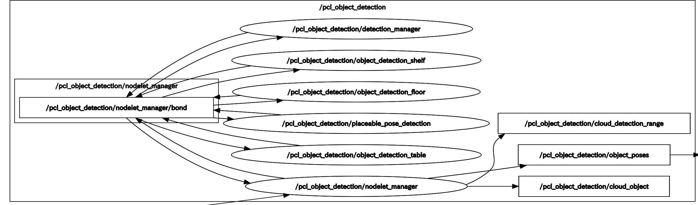

# Point Cloud Object Detection

## Contents

- [pcl_object_detection.launch](#pcl_object_detection.launch)
    - [Node](#node)
    - [Subscriptions](#subscriptions)
    - [Publications](#publications)
    - [Services](#services)
    - [Parameters: detection_manager](#parameters-detectionmanager)
    - [Parameters: 入出力関連](#parameters-入出力関連)
    - [Parameters: PCL関連](#parameters-pcl関連)


## [pcl_object_detection.launch](../launch/pcl_object_detection.launch)

- 机、床、棚上の物体検出と配置位置の検出をします
- 検出位置はトピック通信とTFで出力されます
- 各検出モードはサービス通信によって変更可能
- 検出モード

|番号 | モード名 |意味 | パラメータファイル |
| --- | --- | --- | --- |
| 0 | OFF                | 検出オフ(入力点群を受け取らない) | - |
| 1 | TABLE_MODE         | 机上の物体を検出する | [object_detection_table_param.yaml](../../param/object_detection_table_param.yaml) |
| 2 | FLOOR_MODE         | 床上の物体を検出する | [object_detection_floor_param.yaml](../../param/object_detection_floor_param.yaml) |
| 3 | SHELF_MODE         | 棚の中の物体を検出する(**未実装**) | [object_detection_shelf_param.yaml](../../param/object_detection_shelf_param.yaml) |
| 4 | PLACEABLE_POSITION | 配置位置を検出する | [placeable_postion_detection_param.yaml](../../param/placeable_postion_detection_param.yaml) |

```bash
# with rviz
$ roslaunch pcl_object_detection pcl_object_detection.launch
# without rviz
$ roslaunch pcl_object_detection pcl_object_detection.launch rviz:=false
# rqt_reconfigure-based parameter configuration
$ roslaunch pcl_object_detection pcl_object_detection.launch rqt_reconfigure:=true
```

> [!NOTE]
> rqt_reconfigureはパラメータを動的に変更できるが，保存はできませんので，手打ちで更新してください． 

<div align="center">
    
</div>


## Node

| Node Name | Meaning |
| --- | --- |
| /pcl_object_detection/nodelet_manager          | ノードレットの管理 |
| /pcl_object_detection/detection_manager        | 検出のオンオフやモードの切り替えを行う |
| /pcl_object_detection/object_detection_table   | 机上の物体を検出する |
| /pcl_object_detection/object_detection_floor   | 床上の物体を検出する |
| /pcl_object_detection/object_detection_shelf   | 棚の中の物体を検出する(**未実装**) |
| /pcl_object_detection/placeable_pose_detection | 配置位置を検出する |


## Subscriptions:

| Topic Name | Type | Meaning |
| --- | --- | --- |
| /points2|sensor_msgs/PointCloud2|入力点群|


## Publications:

| Topic Name | Type | Meaning |
| --- | --- | --- |
| /pcl_object_detection/cloud_detection_range | sensor_msgs/PointCloud2          | 検出範囲の点群 |
| /pcl_object_detection/cloud_object          | sensor_msgs/PointCloud2          | 検出物体点群 |
| /pcl_object_detection/object_poses          | sobit_common_msg/ObjectPoseArray | 検出物体の位置情報 |


## Services:

| Service Name | Type | Meaning |
| --- | --- | --- |
| /pcl_object_detection/run_ctr            | sobit_common_msg/RunCtrl              | 検出のオンオフ |
| /pcl_object_detection/detection_mode_ctr | pcl_object_detection/DetectionModeCtr | 検出モードの切り替え |


## Parameters: detection_manager

| Parameter Name | Type | Meaning |
| --- | --- | --- |
| detection_mode | int | 検出モード|


## Parameters: 入出力関連

| Parameter Name | Type | Default | Meaning |
| --- | --- | --- | --- |
| pointcloud_topic_name         | string | /points2       | サブスクライブする点群のトピック名 |
| base_frame_name               | string | base_footprint | 基準フレーム名 |
| publish_cloud_detection_range | bool   | True           | 検出範囲の点群をパブリッシュするか |
| publish_cloud_object          | bool   | True           | 検出物体の点群をパブリッシュするか |
| publish_pose_array            | bool   | True           | 検出物体の位置をパブリッシュするか |
| use_tf                        | bool   | True           | 検出物体の位置のTFを登録するか |
| use_sobit_pro                 | bool   | False          | SOBIT PROを使用するか(PLACEABLE_POSITIONで使用) |


## Parameters: PCL関連

| Parameter Name | Type | Default | Meaning |
| --- | --- | --- | --- |
| passthrough_x_min         | double | 0.0   | passthroughのx軸の最小距離[m] |
| passthrough_x_max         | double | 2.0   | passthroughのx軸の最大距離[m] |
| passthrough_y_min         | double | -0.6  | passthroughのy軸の最小距離[m] |
| passthrough_y_max         | double | 0.6   | passthroughのy軸の最大距離[m] |
| passthrough_z_min         | double | 0.15  | passthroughのz軸の最小距離[m] |
| passthrough_z_max         | double | 0.8   | passthroughのz軸の最大距離[m] |
| use_voxel                 | bool   | False | ダウンサンプリングするか |
| leaf_size                 | double | 0.01  | ダウンサンプリング間隔[m] |
| threshold_distance        | double | 0.015 | 平面検出時のモデルしきい値(ユーザ指定のパラメータ)の距離[m] |
| probability               | double | 0.95  | 平面検出時の外れ値のないサンプルを少なくとも1つ選択する確率を設定(モデル適合確率) |
| cluster_tolerance         | double | 0.05  | クラスタリングでの点群の幅を設定[m] |
| min_cluster_point_size    | int    | 100   | クラスタの点群最小サイズ[個] |
| max_cluster_point_size    | int    | 8000  | クラスタの点群最大サイズ[個] |
| object_size_x_min         | double | 0.0   | object_sizeのx軸の最小距離[m] |
| object_size_x_max         | double | 1.0   | object_sizeのx軸の最大距離[m] |
| object_size_y_min         | double | 0.0   | object_sizeのy軸の最小距離[m] |
| object_size_y_max         | double | 1.0   | object_sizeのy軸の最大距離[m] |
| object_size_z_min         | double | 0.0   | object_sizeのz軸の最小距離[m] |
| object_size_z_max         | double | 1.0   | object_sizeのz軸の最大距離[m] |
| object_centroid_offset_x  | double | 0.0   | 物体位置のx軸のオフセット[m] |
| object_centroid_offset_y  | double | 0.0   | 物体位置のy軸のオフセット[m] |
| object_centroid_offset_z  | double | 0.0   | 物体位置のz軸のオフセット[m] |
| placeable_search_interval | double | 0.01  | 配置位置の検索間隔[m] (PLACEABLE_POSITIONで使用) |
| obstacle_tolerance        | double | 0.05  | 配置位置の検索での障害物許容範囲[m] (PLACEABLE_POSITIONで使用) |
